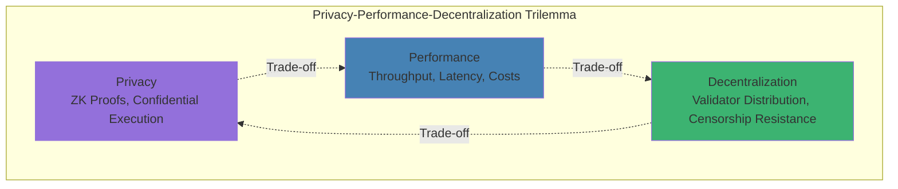
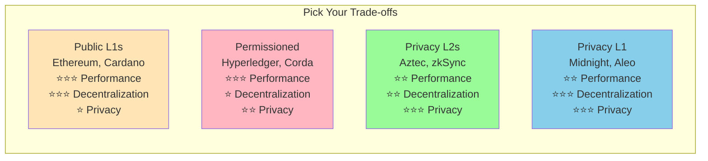
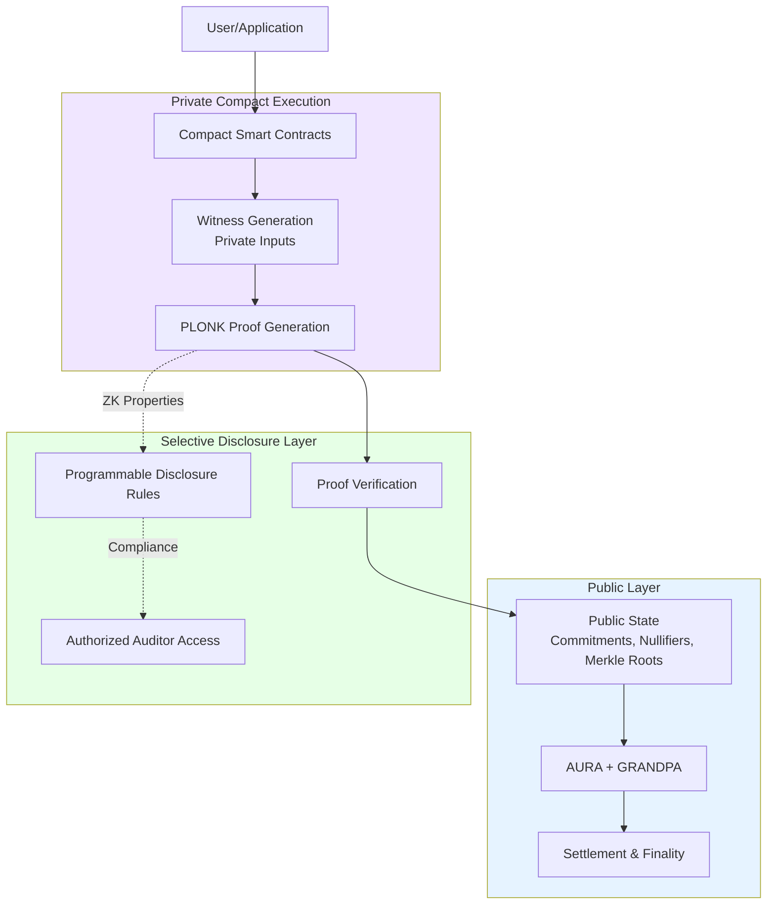
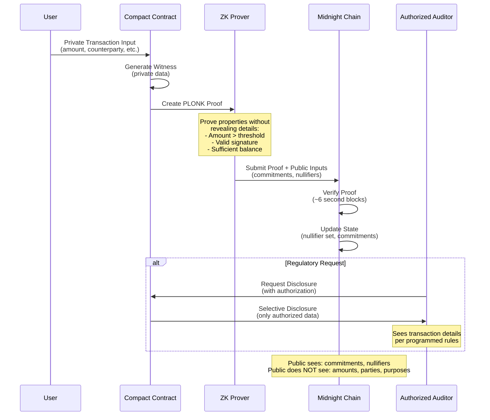
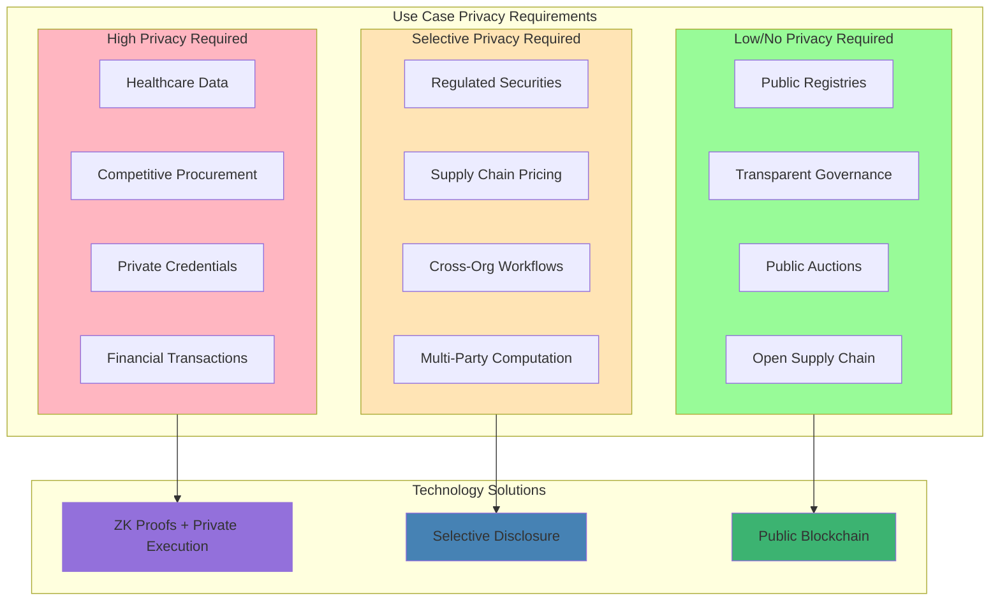
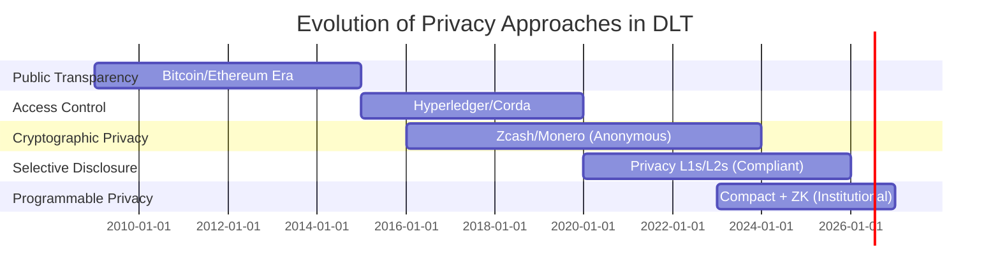
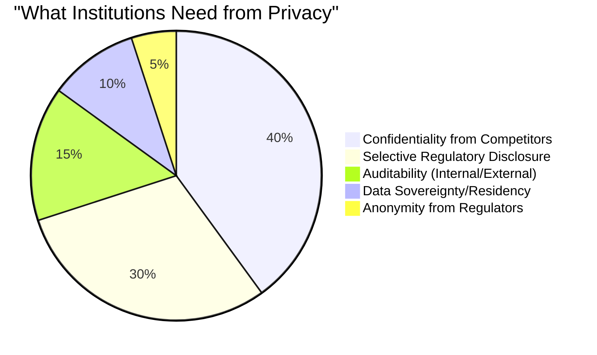
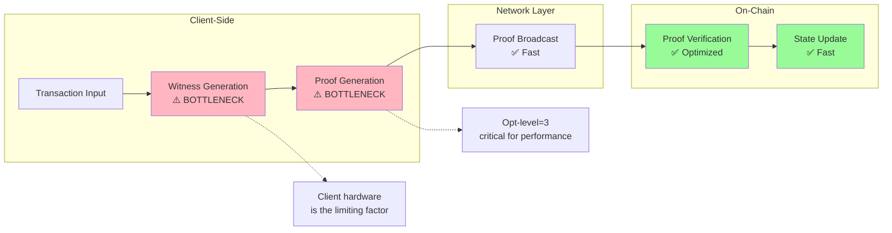
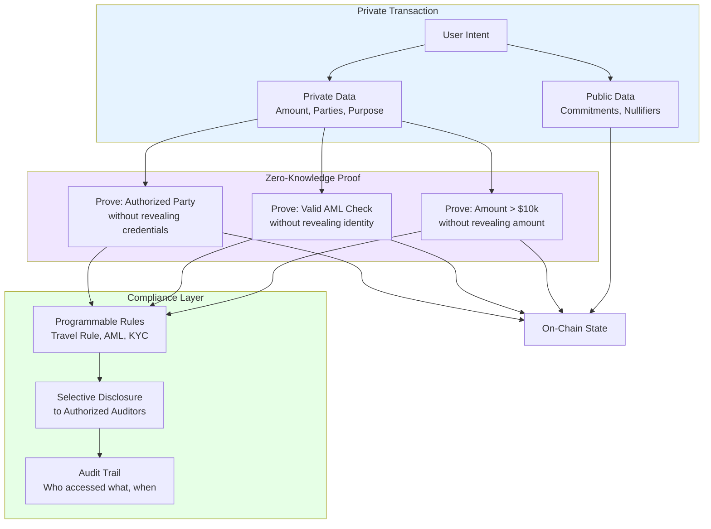

# Panel Diagrams and Visual Aids

## 1. Privacy-Performance-Decentralization Trilemma



### Positioning Different Systems



---

## 2. Midnight Dual-State Architecture



---

## 3. Privacy Spectrum and Regulatory Fit

```mermaid
graph LR
    subgraph Spectrum["Privacy Spectrum"]
        direction LR
        A[Full Transparency<br/>Public Blockchains<br/>✅ Easy Compliance<br/>❌ No Privacy]
        B[Access Control<br/>Permissioned DLT<br/>✅ Some Privacy<br/>⚠️ Centralization]
        C[Selective Disclosure<br/>ZK + Programmable<br/>✅ Privacy + Compliance<br/>⚠️ Complexity]
        D[Full Anonymity<br/>Mixers, Anonymous Coins<br/>✅ Maximum Privacy<br/>❌ Regulatory Issues]
    end

    A --> B --> C --> D

    Institutional[Institutional<br/>Use Cases] -.->|"Optimal Balance"| C
    Regulatory[Regulatory<br/>Requirements| -.->|"Acceptable"| C

    style A fill:#FFB6C1
    style B fill:#FFE4B5
    style C fill:#98FB98
    style D fill:#FFB6C1
    style Institutional fill:#87CEEB
    style Regulatory fill:#DDA0DD
```

---

## 4. Selective Disclosure Flow



---

## 5. Use Case Privacy Matching Matrix



---

## 6. Midnight Technology Stack

```mermaid
graph TB
    subgraph Application["Application Layer"]
        SDK[Midnight.js TypeScript SDK<br/>Node 22+ | Turbo + Yarn]
        Wallet[Midnight Wallet<br/>Night Keys Management]
    end

    subgraph Contract["Contract Layer"]
        Compact[Compact Smart Contracts<br/>Privacy-Preserving Logic]
        Compiler[Compact Compiler<br/>Chez Scheme → TypeScript + ZKIR]
    end

    subgraph Proof["Proof System"]
        PLONK[PLONK Proof System]
        Witness[Witness Generation]
        Circuit[Circuit Constraints]
    end

    subgraph Runtime["Substrate Runtime Layer"]
        Pallets[FRAME Pallets<br/>Privacy Operations]
        Weights[Block Weights & Benchmarks]
        Storage[State: Commitments, Nullifiers]
    end

    subgraph Consensus["Consensus Layer"]
        AURA[AURA Block Production<br/>6-second blocks]
        GRANDPA[GRANDPA Finality]
        BEEFY[BEEFY Light Client]
    end

    subgraph Indexer["Indexer Infrastructure"]
        Micro[Microservices Architecture]
        DUST[DUST Tracking Service]
        Null[Nullifier Management]
    end

    SDK --> Compact
    Wallet --> Compact
    Compact --> Compiler
    Compiler --> Witness
    Witness --> PLONK
    PLONK --> Circuit
    Circuit --> Pallets
    Pallets --> Weights
    Weights --> Storage
    Storage --> AURA
    AURA --> GRANDPA
    GRANDPA --> BEEFY

    Storage -.->|"Index"| Micro
    Micro --> DUST
    Micro --> Null

    style Application fill:#E6F3FF
    style Contract fill:#F0E6FF
    style Proof fill:#FFE6F0
    style Runtime fill:#E6FFE6
    style Consensus fill:#FFF9E6
    style Indexer fill:#F0F0F0
```

---

## 7. Privacy vs Transparency Trade-off Timeline



---

## 8. Institutional Privacy Model Preferences



---

## 9. Performance Bottlenecks in Privacy Systems



---

## 10. Compliance Architecture Pattern



---

## Usage Notes for Panel

### When to use each diagram:

1. **Trilemma** - Opening remarks, framing the challenge
2. **Dual-State Architecture** - Explaining Midnight's approach
3. **Privacy Spectrum** - Discussing regulatory fit
4. **Selective Disclosure Flow** - Answering "how does it work?"
5. **Use Case Matrix** - Matching privacy to use cases
6. **Tech Stack** - Performance and operational considerations
7. **Timeline** - Regulator education, industry evolution
8. **Institutional Preferences** - What enterprises actually want
9. **Performance Bottlenecks** - Scaling challenges
10. **Compliance Pattern** - Bringing it all together

### Presentation tips:

- Keep diagrams on screen while discussing
- Point to specific components when making technical points
- Use colors to emphasize trade-offs
- Refer back to trilemma throughout discussion
